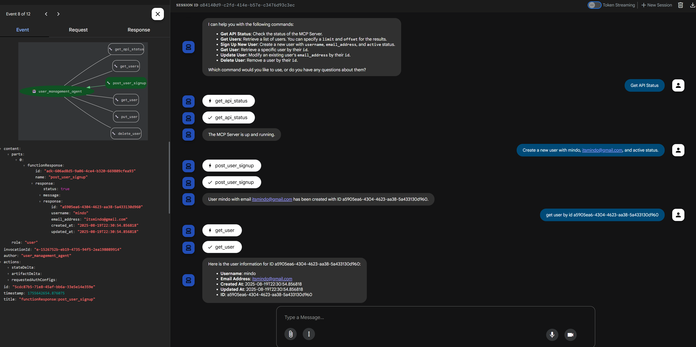
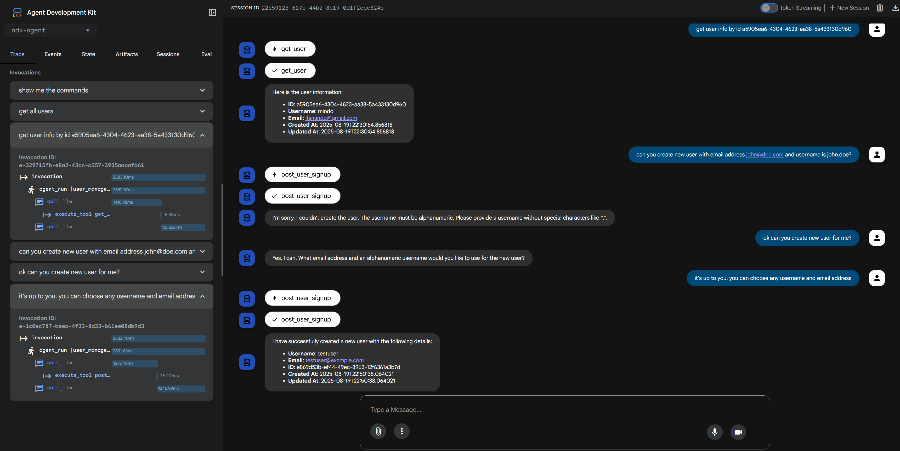

# ADK Agent

### Overview

This project contains an agent system built with the Google Agent Development Kit (ADK). It includes a filesystem agent for file management and a user management agent for interacting with a `FastMCP` server.

## Prerequisites

- **Python**: 3.12+
- **pip**: 25.1+
- **npx**: 11.5+

***

## Setup

1.  Navigate to the `adk-agent` directory: `cd adk-agent`
2.  Rename the sample environment file: `mv .env.sample .env`
3.  Add your **`GOOGLE_API_KEY`** to the `.env` file.
4.  Install the required Python dependencies: `pip install -r requirements.txt`

***

## Usage

Ensure you are in the project's root directory.

### Start the Agent

Run the following command to start the ADK web server. This will launch both the filesystem and user management agents.

```bash
make start-adk-web
```

Navigate to **http://localhost:8000/dev-ui/?app=adk-agent** in your browser to access the ADK Web developer UI.

<div style="display: flex; gap: 20px;">
  <div style="flex: 1;">
    
  </div>
  <div style="flex: 1;">
    
  </div>
</div>

### Start the Agent

Use this command to gracefully stop the ADK web server running in the background.

```bash
make stop-adk-web
```
